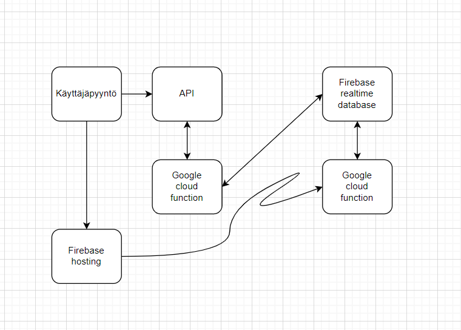
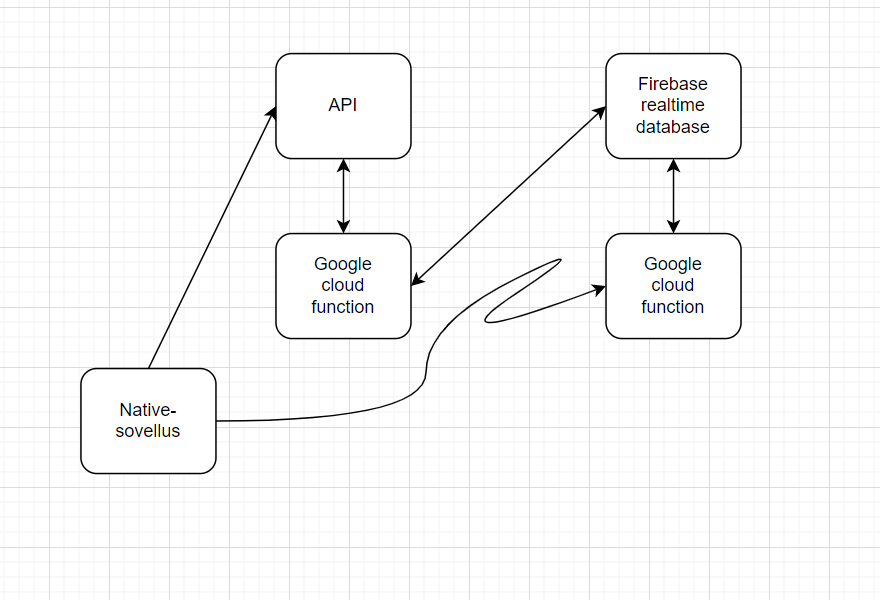
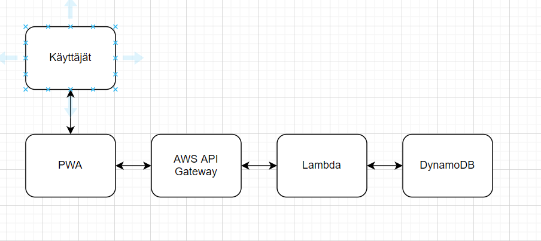

# Esitutkimus

- [Esitutkimus](#esitutkimus)
  - [Projektin tiedot](#projektin-tiedot)
    - [Termit ja lyhenteet](#termit-ja-lyhenteet)
    - [Viitteet](#viitteet)
  - [Johdanto](#johdanto)
  - [Visio](#visio)
  - [Käyttäjäkertomukset](#k%C3%A4ytt%C3%A4j%C3%A4kertomukset)
  - [Tekniset vaatimukset](#tekniset-vaatimukset)
  - [Ratkaisuvaihtoehdot](#ratkaisuvaihtoehdot)
    - [Ratkaisuvaihtoehto 1](#ratkaisuvaihtoehto-1)
      - [Toteutusympäristö](#toteutusymp%C3%A4rist%C3%B6)
      - [Toteutettavat kertomukset](#toteutettavat-kertomukset)
      - [Työmääräarviot](#ty%C3%B6m%C3%A4%C3%A4r%C3%A4arviot)
      - [Pros and Cons](#pros-and-cons)
    - [Ratkaisuvaihtoehto 2](#ratkaisuvaihtoehto-2)
      - [Toteutusympäristö 2](#toteutusymp%C3%A4rist%C3%B6-2)
      - [Toteutettavat kertomukset 2](#toteutettavat-kertomukset-2)
      - [Työmääräarviot](#ty%C3%B6m%C3%A4%C3%A4r%C3%A4arviot-2)
      - [Pros and Cons](#pros-and-cons-2)
    - [Ratkaisuvaihtoehto 3](#ratkaisuvaihtoehto-3)
      - [Toteutusympäristö](#toteutusymp%C3%A4rist%C3%B6-3)
      - [Toteutettavat kertomukset](#toteutettavat-kertomukset-3)
      - [Työmääräarviot](#ty%C3%B6m%C3%A4%C3%A4r%C3%A4arviot-3)
      - [Pros and Cons](#pros-and-cons-3)
  - [Yhteenveto](#yhteenveto)

## Projektin tiedot

Huutoäänestysäppi. Sovellus, jonka avulla ihmiset voivat ratkaista tilanteita äänestämällä.

Tekijät: Jyri Lahtinen, Antti Raita, Severi Natunen, Timo Saarela

### Termit ja lyhenteet

| Termi           | Kuvaus                                                                                                    |
| --------------- | --------------------------------------------------------------------------------------------------------- |
| GIT             | Versionhallintajärjestelmä.                                                                               |
| GitHub          | Palvelu joka on rakennettu GIT versionhallinnan ympärille.                                                |
| Markdown        | Merkkauskieli.                                                                                            |
| PWA             | Progressive Web Application.                                                                              |
| Tikobiz         | Projektin liiketalous puoli.                                                                              |
| Firebase        | Googlen kehittämä alusta mobiili- ja verkkosovellusten kehitykseen.                                       |
| Tikobiz         | Projektin liiketalous puoli.                                                                              |
| Native-sovellus | Sovellus, joka on kehitetty toimimaan tietyllä alustalla tai laitteella.                                  |
| Serverless      | Pilivipalvelumuoto, jossa taustasovelluksen tarvitsema palvelimien määrä otetaan käyttöön tarpeen mukaan. |

### Viitteet

| Viittaus | Materiaali                                                           |
| -------- | -------------------------------------------------------------------- |
| HLTP     | <https://github.com/jamktiko/huutisRepo/blob/main/documents/hltp.md> |

## Johdanto

Tämän dokumentin tarkoitus on tuottaa esitutkimus huutoäänestysäpistä. Huutoäänestysäppi on sovellus, jolla ryhmät voivat ratkaista ongelmatilanteita äänestämällä. Esitutkimuksessa käydään läpi käyttäjäkertomukset, tekniset vaatimukset ja ratkaisuvaatimukset.

## Visio

Kehittämme sovelluksen, joka auttaa ryhmiä muodostamaan yhteisiä päätöksiä äänestämällä. Tarkoituksemme on keskittyä sovelluksen suorituskykyyn ja käytettävyyteen, jotta tilanne on ratkaistu mahdollisimman nopeasti.

## Käyttäjäkertomukset

1. Käyttäjä haluaa liittyä huoneeseen äänestääkseen. Hyväksymiskriteeri: käyttäjä voi liittyä huoneeseen koodilla tai linkillä.
2. Käyttäjä haluaa tehdä huoneen, jotta voidaan äänestää. Hyväksymiskriteeri: Käyttäjä voi tehdä huoneen johon muut voivat liittyä.
3. Käyttäjä haluaa nähdä tulokset, jotta voi päättää. Hyväksymiskriteeri: Käyttäjä näkee tulokset selkeästi esitettynä.
4. Käyttäjä haluaa kutsua muut äänestämään huoneeseen. Hyväksymiskriteeri: Käyttäjä voi luoda eri liittymistapoja.
5. Käyttäjä haluaa valita äänestystavan. Hyväksymiskriteeri: Käyttäjällä on eri vaihtoehtoja äänestämiseen huonetta luodessa.
6. Käyttäjä haluaa äänestää. Hyväksymiskriteeri: Käyttäjä voi valita haluamansa vaihtoehdon.
7. Käyttäjä haluaa muokata äänestyksen asetuksia. Hyväksymiskriteeri: Käyttäjällä on mahdollisuus vaihtaa asetuksia huonetta luodessa.

## Tekniset vaatimukset

Esimerkiksi:

1. Sovelluksen tulee toimia Safarilla, Chromella, Firefox for Android ja Microsoft Edgellä
2. Sovelluksen tulisi avautua alle viidessä sekunnissa.
3. Sovelluksen tulee olla käyttäjäystävällinen värisokeille.
4. Äänestyshuoneen tulee poistua automaattisesti 30 minuutin kuluessa tai kun kaikki käyttäjät ovat poistuneet huoneesta.
5. Sovelluksen tiettyjen ominaisuuksien tulee toimia offline tilassa.
6. Sovelluksen tulee toimia Android 9:llä ja ylsöpäin. sen tulee myös toimia iOS 12 ja ylöspäin.
7. Sovelluksen tulee sisältää web-manifest ja pitää täyttää PWA:n vaatimukset.

## Ratkaisuvaihtoehdot

### Ratkaisuvaihtoehto 1

#### Toteutusympäristö

Sovellus tulee toimimaan selaimessa ladattavana serverless PWA sovelluksena. Sovellusta hostataan firebasessa. 

#### Toteutettavat kertomukset

Käyttäjät voivat ladata sovelluksen PWA:na tai käyttää sitä selaimessa. Kaikki yllä mainitut käyttäjäkertomukset toteutuvat tällä tekniikalla.

#### Työmääräarviot

| Vaihe                   | Tunnit | Muuta?                                                     |
| ----------------------- | ------ | ---------------------------------------------------------- |
| Käynnistys              | 30     | Projektin kehitysympäristön pystytys.                      |
| Uuden opettelu          | 200    |
| Projektisuunnittelu     | 140    |
| Kahvittelu              | 60     | Aika mitä käytetään kahvin juomiseen ja verkostoitumiseen. |
| UI/UX Suunnittelu       | 300    |
| Sovelluksen koodaaminen | 300    |
| Palaverit               | 100    | Scrumin ja sen ulkopuoliset keskustelut ja palaverit.      |
| Käyttäjätestaaminen     | 80     |
| Tekninen testaaminen    | 50     |
| Tikobiz                 | 180    | Kaikki liiketalouteen liittyvä.                            |
| **Yht**                 | 1440   | Koko tiimin yhteenlasketut tunnit.                         |

#### Pros and Cons

Sovellusta pystyy käyttämään helposti selaimessa ja lisäksi lataamaan pikakuvakkeen aloitusnäyttöön. Sovellusta voi myös käyttää tietokoneella. Välimustin ansiosta sovellus avautuu nopeammin kuin natiivisovellus. Sovellus ei vaadi mitään pitkäaikaista tallennettavaa. Sovelluksen käyttäminen ei vaadi kirjautumista. UI/UX suunnittelu voi olla hankalaa, koska kyseessä ei ole natiivisovellus.

### Ratkaisuvaihtoehto 2

#### Toteutusympäristö 2

Sovellus tulee toimimaan serverless natiivisovelluksena, jonka voi ladata play androidille Play kaupasta ja iOS:lle App storesta. 

#### Toteutettavat kertomukset 2

Asiakas pystyy lataamaan sovelluksen play kaupasta tai app storesta. Kaikki yllä mainitut käyttäjäkertomukset toteutuvat tällä tekniikalla.

#### Työmääräarviot 2

| Vaihe                   | Tunnit | Muuta?                                                     |
| ----------------------- | ------ | ---------------------------------------------------------- |
| Käynnistys              | 30     | Projektin kehitysympäristön pystytys.                      |
| Uuden opettelu          | 350    | Paljon enemmän uutta opeteltavaa PWA verrattuna.           |
| Projektisuunnittelu     | 140    |
| Kahvittelu              | 60     | Aika mitä käytetään kahvin juomiseen ja verkostoitumiseen. |
| UI/UX Suunnittelu       | 225    |
| Sovelluksen koodaaminen | 225    |
| Palaverit               | 100    | Scrumin ja sen ulkopuoliset keskustelut ja palaverit.      |
| Käyttäjätestaaminen     | 80     |
| Tekninen testaaminen    | 50     |
| Tikobiz                 | 180    | Kaikki liiketalouteen liittyvä.                            |
| **Yht**                 | 1440   | Koko tiimin yhteenlasketut tunnit.                         |

#### Pros and Cons 2

Nativiisovelluksessa voidaan hyödyntää jo opittuja web teknologioita. Natiivisovellus voi hyödyntää puhelimen omia ominaisuuksia paremmin. Natiivisovellusta ei saa selaimeen. Natiivisovelluksen kulut voivat olla suuremmat ja vaatii enemmän resursseja. Julkaistun natiivisovelluksen ylläpito on vaikeaa.

### Ratkaisuvaihtoehto 3

#### Toteutusympäristö 3

Sovellus toimii ladattavana PWA:na. Sovellus hostataan AWS pilvipalveluissa. Sovelluksen backend toimii myös AWS pilvipalveluilla. 

#### Toteutettavat kertomukset 3

Käyttäjät voivat ladata sovelluksen PWA:na tai käyttää sitä selaimessa. Kaikki yllä mainitut käyttäjäkertomukset toteutuvat tällä tekniikalla.

#### Työmääräarviot 3

| Vaihe                   | Tunnit | Muuta?                                                     |
| ----------------------- | ------ | ---------------------------------------------------------- |
| Käynnistys              | 30     | Projektin kehitysympäristön pystytys.                      |
| Uuden opettelu          | 300    | Pitää opetella käyttämään AWS:n pilvipalveluja.            |
| Projektisuunnittelu     | 140    |
| Kahvittelu              | 60     | Aika mitä käytetään kahvin juomiseen ja verkostoitumiseen. |
| UI/UX Suunnittelu       | 250    |
| Sovelluksen koodaaminen | 250    |
| Palaverit               | 100    | Scrumin ja sen ulkopuoliset keskustelut ja palaverit.      |
| Käyttäjätestaaminen     | 80     |
| Tekninen testaaminen    | 50     |
| Tikobiz                 | 180    | Kaikki liiketalouteen liittyvä.                            |
| **Yht**                 | 1440   | Koko tiimin yhteenlasketut tunnit.                         |

#### Pros and Cons 3

Koululta saa ilmaista crediittiä AWS pilvipalveluihin. Arvioimme, että AWS palveluja käyttämällä syntyy vähemmän kuluja kuin firebasella. AWS palveluilla on kattavat dokumentaatiot ja ohjeita löytyy paljon, mikä helpottaa uuden opettelua. Projektia hankaloittaa hiukan se, että tiimin pitää opetella käyttämään AWS pilvipalveluita.

## Yhteenveto

Projektin toteutustavaksi valitaan vaihtoehto 3: Serverless PWA AWS backendillä. Tämä päätös tehtiin, koska todettiin että natiivisovelluksen kehittäminen vaatisi liikaa resursseja. PWA sopii meidän tarkoitukseen paremmin, koska voimme kehittää yhtä aikaa kaikille alustoilla saman sovelluksen. Tiimistä löytyy valmiiksi PWA osaamista mikä nopeuttaa kehitysprosessia, koska ei tarvitse opiskella uusia asioita. AWS palveluitten opettelu vaatii oman aikansa, mutta se tulee halvemmaksi kuin firebase.
